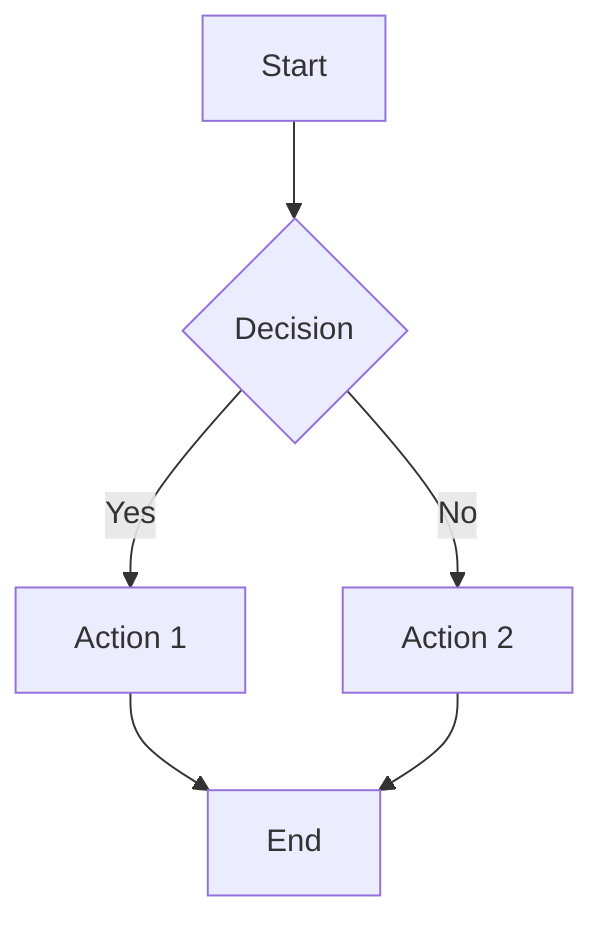

# Mermaid Live Editor

A powerful web-based editor for creating, editing, and sharing Mermaid diagrams in real-time. This is a personal fork of the official [mermaid-live-editor](https://github.com/mermaid-js/mermaid-live-editor) with custom modifications and improvements.

## 🚀 Features

* **Real-time Preview** : Edit and preview diagrams instantly
* **Multiple Diagram Types** : Support for flowcharts, sequence diagrams, Gantt charts, and more
* **Export Options** : Save diagrams as SVG files
* **Share & Collaborate** : Generate shareable links for viewing and editing
* **Modern UI** : Built with SvelteKit for a smooth user experience

## 🛠️ Supported Diagram Types

* Flowcharts
* Sequence Diagrams
* Gantt Charts
* Class Diagrams
* State Diagrams
* Entity Relationship Diagrams
* User Journey Diagrams
* And many more!

## 🏃‍♂️ Quick Start

### Prerequisites

* Node.js (v16 or higher)
* pnpm package manager

### Installation

1. Clone the repository:

```bash
git clone https://github.com/pattang56892/mermaid.git
cd mermaid
```

2. Install dependencies:

```bash
pnpm install
```

3. Start the development server:

```bash
pnpm dev -- --open
```

4. Open your browser and navigate to `http://localhost:5173`

## 🐳 Docker Setup

### Using Pre-built Image

```bash
docker run --platform linux/amd64 --publish 8000:8080 ghcr.io/mermaid-js/mermaid-live-editor
```

### Docker Compose (Development)

```bash
docker compose up --build
```

Then visit `http://localhost:3000`

### Manual Docker Build

```bash
docker build -t mermaid-live-editor .
docker run --detach --name mermaid-live-editor --publish 8080:8080 mermaid-live-editor
```

## 📝 Usage Example

Create a simple flowchart:



## 🔧 Configuration

### Environment Variables

* `MERMAID_RENDERER_URL`: Set rendering service URL (default: https://mermaid.ink)
* `MERMAID_KROKI_RENDERER_URL`: Set Kroki instance URL (default: https://kroki.io)
* `MERMAID_ANALYTICS_URL`: Set analytics service URL
* `MERMAID_DOMAIN`: Set your domain for analytics
* `MERMAID_IS_ENABLED_MERMAID_CHART_LINKS`: Enable Mermaid Chart links (default: false)

### Build Arguments

When building with Docker, you can customize these settings:

```bash
docker build \
  --build-arg MERMAID_RENDERER_URL=your-renderer-url \
  --build-arg MERMAID_KROKI_RENDERER_URL=your-kroki-url \
  -t mermaid-live-editor .
```

## 🤝 Contributing

1. Fork the repository
2. Create a feature branch (`git checkout -b feature/amazing-feature`)
3. Commit your changes (`git commit -m 'Add amazing feature'`)
4. Push to the branch (`git push origin feature/amazing-feature`)
5. Open a Pull Request

## 📜 Scripts

* `pnpm dev`: Start development server
* `pnpm build`: Build for production
* `pnpm preview`: Preview production build
* `pnpm lint`: Run linter
* `pnpm test`: Run tests

## 🏗️ Tech Stack

* **Frontend** : SvelteKit
* **Package Manager** : pnpm
* **Containerization** : Docker
* **Diagram Rendering** : Mermaid.js

## 📚 Resources

* [Mermaid Documentation](https://mermaid-js.github.io/mermaid/)
* [Live Demo](https://mermaid.live/)
* [Original Repository](https://github.com/mermaid-js/mermaid-live-editor)

## 📄 License

This project follows the same license as the original Mermaid Live Editor. Please check the [LICENSE](https://claude.ai/chat/LICENSE) file for details.

## 🙋‍♂️ Support

If you encounter any issues or have questions:

1. Check the [Issues](https://github.com/pattang56892/mermaid/issues) page
2. Create a new issue if your problem isn't already reported
3. Provide detailed information about your environment and the issue

## ⭐ Acknowledgments

* Original [Mermaid Live Editor](https://github.com/mermaid-js/mermaid-live-editor) team
* [Mermaid.js](https://github.com/mermaid-js/mermaid) community
* All contributors who help improve this project

---

Made with ❤️ by [pattang56892](https://github.com/pattang56892)
